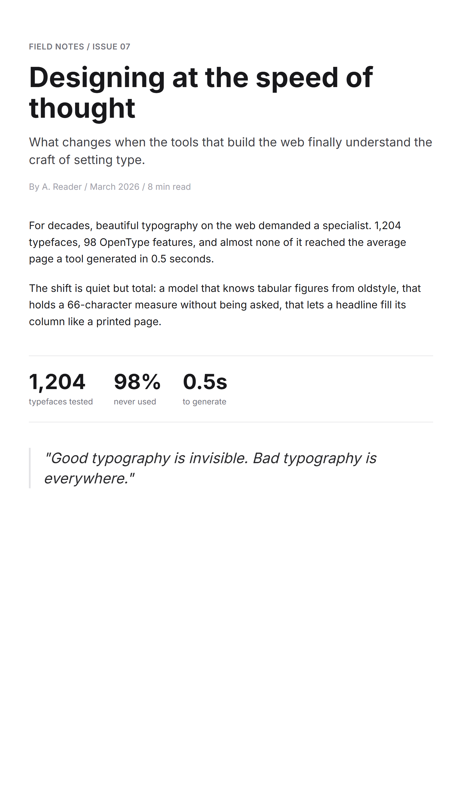
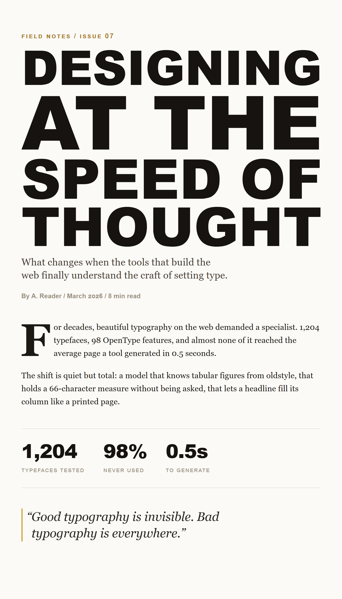

<div align="center">

# hypertype

### Justified display headlines and the OpenType features almost nobody turns on.<br>No dependencies. Paste it into a page.

[Quick start](#quick-start) · [What's in it](#whats-in-it) · [Use as a Claude skill](#use-as-a-claude-skill) · [API](#api) · [Reference](docs/REFERENCE.md)


</div>

CSS can justify a paragraph but not a display headline. There is no way in plain CSS to make every line of a big heading stretch to fill the column the way a magazine does. hypertype does that. While it's at it, it turns on the OpenType features most generated markup ignores: tabular and oldstyle figures, real small caps, fractions, a slashed zero. It's one small file you paste into a page. No build step, no npm.

## Before and after

<div align="center">

| Plain CSS | With hypertype |
|:---:|:---:|
|  |  |

</div>

Same words, same layout. The only thing that changed is the type: a justified headline, a serif at a sane line length, a drop cap, small caps on the labels, figures that line up, and quotes that hang into the margin.

## Quick start

hypertype is meant to be inlined. That sounds primitive, but it's the one format that survives the AI tools that write a whole HTML file at once and won't run a build or fetch a stylesheet. If you just want a working file to copy, there's one at [`dist/hypertype-inline.html`](dist/hypertype-inline.html).

```html
<!-- 1. Paste hypertype.css into a <style> block; put class="ht" on a wrapper. -->
<div class="ht">
  <h1 data-slab>The future is unevenly distributed</h1>
  <p class="ht-justify" lang="en">Body copy with real hyphenation and a sane line length.</p>
  <table><td class="ht-data">1,024.50</td></table>
</div>

<!-- 2. Paste slab.js into a <script> and call slabAll(). -->
<script>/* …slab.js… */ slabAll('[data-slab]');</script>
```

That's the whole install. Nothing to bundle, nothing to fetch.

## What's in it

A headline engine, `slab.js`, that does the justified-slab layout CSS can't: it measures the words, breaks them into lines of roughly equal length, and sizes each line to fill the column.

The OpenType layer, as plain utility classes. `ht-tnum` for tables, `ht-onum` for prose, `ht-smallcaps`, `ht-frac`, and the rest. They use the `font-variant-*` properties, which compose, rather than `font-feature-settings`, which silently overwrites itself.

Width-axis fitting for variable fonts. If the font can stretch, every line keeps the same height; if it can't, the size scales per line instead. You don't pick, it detects.

The modern CSS niceties (a type scale, a sensible measure, `text-wrap: balance` and `pretty`, drop caps, cap-height trim) each sit behind `@supports`, so a browser that doesn't have them just skips them.

And `micro.js`, which hangs a leading quote into the margin, the one bit of polish Safari does on its own and the others don't.

## Use it as a skill

The kit also ships as an [Agent Skill](skill/SKILL.md), a cross-agent standard that Claude Code, Cursor, and other agent tools read, so the model reaches for it on its own when you ask for a headline, a hero, or "make the type less generic."

[](https://vscode.dev/redirect?url=vscode:chat-instructions/install?url=https://raw.githubusercontent.com/sceboucher/hypertype/main/dist/hypertype.instructions.md)
[](https://sceboucher.github.io/hypertype/install/#claude-code)
[](https://sceboucher.github.io/hypertype/install/#cursor)
[](https://sceboucher.github.io/hypertype/install/#codex-gemini-cli-and-other-agent-clis)
[](https://sceboucher.github.io/hypertype/install/#chatgpt-claude-desktop-and-other-chat-tools)

The **VS Code** button is a genuine one-click: it installs hypertype as a Copilot custom-instructions file. In **Claude Code**, install it as a plugin:

```
/plugin marketplace add sceboucher/hypertype
/plugin install hypertype@hypertype
```

The rest (Cursor, the agent CLIs, pasting into ChatGPT or Claude Desktop) are a step or two each, on the [install page](https://sceboucher.github.io/hypertype/install/). Outside VS Code, no real one-click deeplink exists for skills yet.

## Verify fonts for real: the MCP server

The skill tells a model to check that a font carries a feature before turning it on. [`@sceboucher/hypertype`](mcp/) lets it actually check. It's a local MCP server that reads the OpenType features and variable axes straight from the served font file, so `font-variant-caps: small-caps` on a font with no small caps comes back as a real warning instead of a silent fake. It also generates context-fit type systems and critiques typographic hierarchy from rendered CSS.

[](cursor://anysphere.cursor-deeplink/mcp/install?name=hypertype&config=eyJjb21tYW5kIjoibnB4IiwiYXJncyI6WyIteSIsIkBzY2Vib3VjaGVyL2h5cGVydHlwZSJdfQ==)
[](https://insiders.vscode.dev/redirect/mcp/install?name=hypertype&config=%7B%22name%22%3A%22hypertype%22%2C%22command%22%3A%22npx%22%2C%22args%22%3A%5B%22-y%22%2C%22%40sceboucher%2Fhypertype%22%5D%7D)

In **Claude Code**: `claude mcp add hypertype -- npx -y @sceboucher/hypertype`. It runs locally with no API key, and is the only path that can analyze your installed and Adobe-activated fonts. Ten tools (`analyze_font`, `check_css`, `recommend_css`, `design_type_system`, `critique_hierarchy`, and more) are documented in [mcp/README.md](mcp/README.md).

The deeper typographic judgment the server encodes is written up in two guides: [building a type system](docs/TYPE-SYSTEMS.md) and [using hierarchy well](docs/HIERARCHY.md).

## API

`slab.js`:

```js
slabify(el, { min = 8, max = 1200, lineHeight = 0.88, refine = true, mode = 'auto' });
slabAll(selector = '[data-slab]', opts);   // every matching element
```

It measures the text on a canvas, packs the words into equal-width lines, sizes each line to the column, waits for `document.fonts.ready`, and re-runs under a `ResizeObserver` (guarded on width so it can't loop). The real text stays in the element, so it copies and reads aloud fine. `refine` does a binary search per line against the actual rendered width for flush edges. `mode: 'auto'` uses the width axis where it can and scales the font size otherwise; pass `'width'` or `'size'` to force one.

`micro.js`:

```js
micro(selector = '[data-micro]', { quotes = true, hang = true });
```

`hypertype.css` utility classes:

| Class | For |
|---|---|
| `ht-tnum` / `ht-data` | tabular figures (tables, tickers) / tabular + slashed zero (IDs, money) |
| `ht-onum` | oldstyle figures in running prose |
| `ht-smallcaps` | true small caps for acronyms |
| `ht-caps` | ALL-CAPS with case-sensitive forms and tracking |
| `ht-frac` | diagonal fractions (scope it tightly) |
| `ht-justify` | justified body copy with hyphenation (set a `lang` attribute) |
| `ht-dropcap` / `ht-hang` | drop cap / hanging punctuation |
| `ht-measure` / `ht-display` | line-length cap / fluid display size |

The full OpenType tag list, the variable-font axes, and the `@supports` support table are in [`docs/REFERENCE.md`](docs/REFERENCE.md).

## Size

No dependencies. The whole kit is about 6 kB gzipped (`slab.js` 3.2, `hypertype.css` 1.8, `micro.js` 1.3), and you only include the parts you use. A `<style>` block plus a small `<script>` is the only thing that pastes cleanly into every AI tool and sandbox, so that's the real distribution; npm and a CDN are there for convenience.

## Develop

```bash
npm test            # node --test, 28 tests, zero deps
npm run build       # regenerate the skill files and the inline bundle from source
```

`build/generate.mjs` keeps `SKILL.md` and `paste-block.md` in sync with [`skill/canonical.md`](skill/canonical.md). The test suite also checks the CSS stays under its size budget and that every progressive-enhancement feature stays behind `@supports`. Design notes are in [`docs/SYNTHESIS.md`](docs/SYNTHESIS.md); how it was tested is in [`docs/VERIFICATION.md`](docs/VERIFICATION.md).

## License

[MIT](LICENSE)
